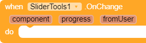
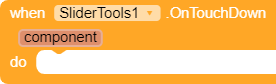
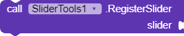

# SliderTools-AI2-Kodular-Extension
 Some useful feature for sliders in AI2 and its disturbution.
 
# Blocks
<table style="width:100%">
    <tr>
        <th style="width:40%">Blocks</th>
        <th style="width:60%">Description</th>
    </tr>
    <tr>
        <td>
            
        </td>
        <td>Rasies when any error occurred.  
            <table>
                <tr>
                    <th>Params</th>
                    <th>Type</th>
                    <th>Description</th>
                </tr>
                <tr>
                    <td>error</td>
                    <td>String</td>
                    <td>Return an exception error in String form.</td>
                </tr>
            </table>
        </td>
    </tr>
    <tr>
        <td>
            
        </td>
        <td>Raises when any registered slider's thumb position changed. If it is changed by the user, fromUser will be
            true, otherwise false.  
            <table>
                <tr>
                    <th>Params</th>
                    <th>Type</th>
                    <th>Description</th>
                </tr>
                <tr>
                    <td>component</td>
                    <td>Component (Slider)</td>
                    <td>Return the component that it's thumb position changed.</td>
                </tr>
                <tr>
                    <td>component</td>
                    <td>Number (float)</td>
                    <td>Return the position of the slider that it's thumn position changed.</td>
                </tr>
                <tr>
                    <td>fromUser</td>
                    <td>boolean</td>
                    <td>Return true if the change is made by the User, otherwise false.</td>
                </tr>
            </table>
        </td>
    </tr>
    <tr>
        <td>
            
        </td>
        <td>Rasies when any registered slider is touched down.  
            <table>
                <tr>
                    <th>Params</th>
                    <th>Type</th>
                    <th>Description</th>
                </tr>
                <tr>
                    <td>component</td>
                    <td>Component (Slider)</td>
                    <td>Return the component that has been touched down.</td>
                </tr>
            </table>
        </td>
    </tr>
    <tr>
        <td>
            
        </td>
        <td>Rasies when any registered slider is touched up.  
            <table>
                <tr>
                    <th>Params</th>
                    <th>Type</th>
                    <th>Description</th>
                </tr>
                <tr>
                    <td>component</td>
                    <td>Component (Slider)</td>
                    <td>Return the component that has been touched up.</td>
                </tr>
            </table>
        </td>
    </tr>
    <tr>
        <td>
            
        </td>
        <td>Register a slider component.  
            <table>
                <tr>
                    <th>Params</th>
                    <th>Type</th>
                    <th>Description</th>
                </tr>
                <tr>
                    <td>slider</td>
                    <td>Component (slider)</td>
                    <td>Input a slider component to register.</td>
                </tr>
            </table>
        </td>
    </tr>
    <tr>
        <td>
            
        </td>
        <td>Unregister a slider component.  
            <table>
                <tr>
                    <th>Params</th>
                    <th>Type</th>
                    <th>Description</th>
                </tr>
                <tr>
                    <td>slider</td>
                    <td>Component (slider)</td>
                    <td>Input a slider component to unregister.</td>
                </tr>
            </table>
        </td>
    </tr>
</table>
	
# Errors

The Error Ocuured event will only return exception error.
	
# Change Log
<small><i>No change log yet ;)</i></small>

# Reference
[Kodular Community]()
[MIT AI2 Community]()
